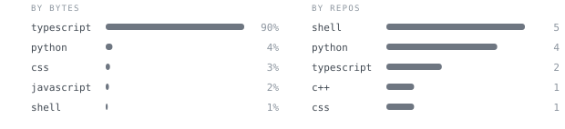
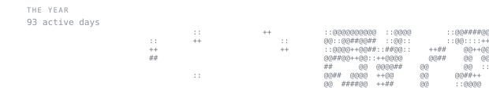

  

  <a href="https://adarsh-67.is-a.dev">website</a>
  ·
  <a href="https://www.linkedin.com/in/adarsh67">linkedin</a>
  ·
  <a href="https://github.com/adarsh-67r">github</a>

<blockquote>
Undergraduate at NIT Rourkela. Into programming, math, and building things.
</blockquote>

I'm Adarsh, an undergraduate student at NIT Rourkela. I'm into programming,
math, and problem-solving. This profile is my personal space on the internet.
Outside screens I enjoy music, anime, and reading manhwa and web novels.

<samp>languages</samp>

<samp>Python · C++ · JavaScript · TypeScript · Bash</samp>

<samp>frontend</samp>

<samp>React · Vite · Tailwind · Astro</samp>

<samp>tools</samp>

<samp>Linux · Git · Docker · Neovim · VS Code</samp>

<samp>learning</samp>

<samp>Rust</samp>

- **Arithi-Official** · Next.js, React, TypeScript, Prisma
- **RouteMind AI** · MERN, Groq API
- **CPOS** · Rust CLI tooling
- **Portfolio and DSA documentation** · React, Vite, JavaScript

 

Generated locally by this repository. Stats are refreshed by GitHub Actions;
the portrait is rendered as a self-typing SVG. No third-party stats widgets.
